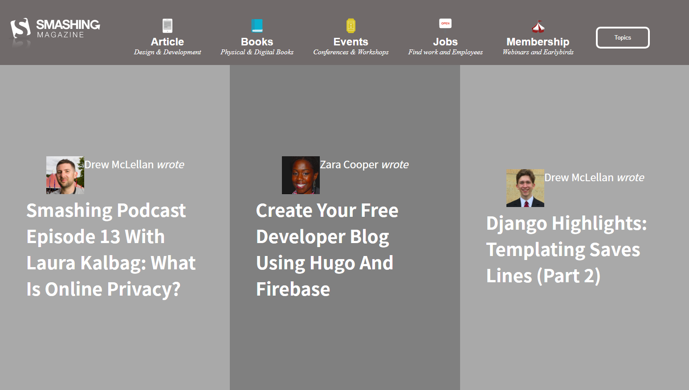

# Smashing-Magazine-Homepage
A replica of the smashing magazine homepage

## The major features in this project are:

1.  Combination of different fonts and typography
2.  Usage of different color combination

## Built With

1. HTML
2. CSS
3. Google font

## Live Demo

* [live demo](https://raw.githack.com/SafaErden/Smashing-Magazine-Homepage/homepage/index.html)

## Getting Started

1. Clone this Repo using `https://github.com/SafaErden/Smashing-Magazine-Homepage`
2. Navigate to `localhost:5500/index.html` in your Browser to access the page

## Authors

👤 Author1

-Github: @evansinho
-email: Igiri.evanson@gmail.com

👤 Author2

-Github: @safaerden
-email: safaerden@gmail.com

## 🤝Contributing

Contributions, issues and feature requests are welcome!

Feel free to check the issues page.

Show your support
Give a ⭐️ if you like this project!

## 📝 License

This project is MIT licensed.
